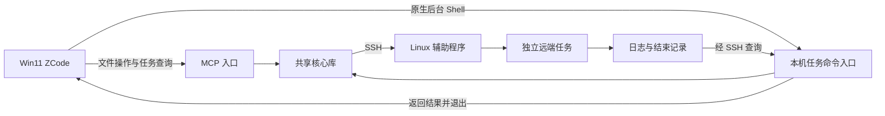

# SSH 远程开发首版规格

状态：首版已实现并通过 2026-09-11 用户人工验收（本机 ZCode + CentOS 7 VM）；最终内网离线现场验收未完成，无 root 与旧 glibc 约束不变。2026-09-12 批准的三项扩展（setup 预存 SSH 连接库、同一项目多命名绑定、可选解除文件目录边界）已实现并自动验证，见 [progress.md](progress.md) 与 [contracts.md](contracts.md) 的扩展契约；扩展部分尚未人工验收。

## 目标

在内网 Win11 上运行 ZCode，通过 SSH 操作 CentOS 7 工程，支持可靠文件读写、非交互命令、后台完成回传及断线恢复。目标机不能联网、无 root 权限，必须兼容旧版 glibc。

典型流程：读取工程和规则 → 搜索与修改文件 → 后台执行 `make build` → 主 Agent 可继续其他工作 → 构建结束后收到结果并继续处理。SSH 断线或本机退出后，远端继续；恢复连接后找回原任务并恢复跟进。

## 阅读入口

- [接口与一致性契约](contracts.md)：文件工具、任务状态、日志和失败处理。
- [实施与验收计划](implementation-plan.md)：先验证关键链路，再按可独立验收的阶段实施。
- [需求事实与术语](CONTEXT.md)、[现有代码调查](discovery.md)、[交互式延期评估](interactive-assessment.md)。

## 用户故事

1. 作为开发者，我希望在 Win11 的 ZCode 操作 Linux 工程，以便使用服务器已有开发环境。
2. 作为开发者，我希望辅助能力可以离线、无 root 部署，以便不改动旧系统的运行基础。
3. 作为 Agent，我希望获取远端工程目录、文件列表和项目规则，以便明确当前操作的位置与约定。
4. 作为 Agent，我希望按行读取文件、搜索路径和内容，以便处理大仓库而不一次载入所有内容。
5. 作为开发者，我希望 Agent 修改文件前确实读取过相关内容，以便减少盲改。
6. 作为开发者，我希望文件在读取后有版本变化时拒绝覆盖，以便保留我的修改。
7. 作为 Agent，我希望安全地创建、覆盖、上传、删除和移动文件，以便完成日常工程操作。
8. 作为开发者，我希望普通命令仍能自由执行，以便正常编译、测试和生成文件。
9. 作为 Agent，我希望命令具有明确的工作目录、环境和退出结果，以便判断执行情况。
10. 作为开发者，我希望长命令在后台运行，以便主对话继续工作。
11. 作为 Agent，我希望增量读取日志并获取最终结果，以便处理输出很多的构建或搜索任务。
12. 作为开发者，我希望停止指定任务及其受管理子进程，以便取消不再需要的工作。
13. 作为开发者，我希望断线或本机退出时远端任务继续，以便不丢失长时间计算。
14. 作为 Agent，我希望重连后识别原任务而不是重跑命令，以便避免重复副作用。
15. 作为开发者，我希望任务完成后主动触发原对话继续处理，以便不依赖模型记得查询。
16. 作为开发者，我希望恢复客户端后补回未处理结果，以便不会只留下无人跟进的任务编号。
17. 作为 Agent，我希望区分命令失败、无搜索匹配、网络中断和状态未知，以便选择正确的后续操作。
18. 作为开发者，我希望并行任务的日志、取消和结果不会串到其他工程或对话，以便安全并行工作。

## 首版范围

| 领域 | 要求 |
|---|---|
| 工程上下文 | 一个显式工作区绑定一个远端连接和工程根；可配置多个独立工作区 |
| 文件操作 | 列目录、按路径查找、按行读取、内容搜索、文本编辑、覆盖写、新建、传输、单文件删除/移动 |
| 写保护 | 专用文件工具要求先读、版本校验、冲突拒绝；新建要求目标不存在 |
| 命令 | 非交互 Shell，支持工作目录、环境变量、管道与重定向、并行任务 |
| 后台结果 | ZCode 原生后台 Shell 执行本机命令入口，程序等待远端结果并退出，由 ZCode 回传 |
| 恢复 | 远端任务独立存活、日志和结果持久保存、本机恢复时重建跟进 |
| 大输出 | 增量读取、有界工具返回、明确截断与日志保留状态 |
| 取消 | 显式取消受管理任务；等待结束和连接断开均不自动取消 |

## 实现结构提案

**MCP 与本机命令入口复用同一 TypeScript 核心库。** 两个进程不依赖彼此的内存对象；远端任务记录作为执行状态依据，本机持久记录保存工作区、对话归属和结果跟进信息。首版不因共享状态额外引入数据库服务或网络监听端口。

图中的共享核心库是代码复用，不是单例进程。本机命令入口在启动远端任务前记录任务身份和归属，同一次调用负责启动与等待，避免要求模型完成两次相互依赖的登记操作。

**远端辅助程序优先采用已有 Bash 与基础系统命令。** 第一阶段探测 `bash`、`setsid`、`nohup`、`flock`、`sha256sum`、`stat`、`base64`、文件系统行为和 SFTP；不预设已经存在。缺少必要能力时，先明确离线补齐方式或调整执行器，不在线安装，也不直接换成要求新版 glibc 的二进制。辅助程序最终依赖表在第一阶段结束时锁定。

**文件修改在远端完成最后一次校验与替换。** 本机准备内容，辅助程序对协作写入加锁、验证预期版本，再实施变更。对任意外部程序不承诺强制锁定，详见契约边界。

**命令默认无伪终端且关闭标准输入。** 每次显式确定工作目录；可通过环境变量或同一命令内的初始化脚本配置工具链。不承诺一次命令的 `cd` / `export` 自动影响下一次调用。

## 与上游的关系

- 保留认证、连接配置、代理与连接管理基础；新增文件服务、任务服务及其薄工具入口，避免继续将所有职责堆入现有连接管理器。
- 增加显式的远程开发模式；未启用时保留上游已有工具契约。开发模式的工具列表提供受保护文件接口，避免同时注册容易误用的无保护覆盖上传入口。
- 普通 Shell 不做全局写入拦截。工具描述与配套指引引导 Agent 用 MCP 操作文件、用 ZCode 后台 Shell 运行命令。
- 旧版堡垒机 `shell` transport 不默认为新能力的可用实现。是否可用由能力探测决定；不满足要求时保留旧功能并明确新功能不可用。
- 新增的本机命令入口复用连接配置，但不将密码、私钥正文等放进模型输出、任务编号或日志。Windows 命令参数使用参数数组或可靠引用，不拼接明文凭据。

## 交互式延期

首版只实现非交互执行，保留任务与连接分离、执行器边界、增量输出和能力声明。以后增加输入/关闭输入与终端执行器，不要求重做任务编号、文件工具或完成回传。当前不暴露尚未实现的交互式接口。

## 不在首版范围

- 全屏终端应用、持续交互输入、远端桌面，以及可重连的交互 PTY。
- 拦截任意 Shell 的所有文件写入，或与不协作外部写入者之间的强隔离。
- 自动升级目标操作系统/glibc、在线安装远端依赖、要求 root。
- 服务器重启后自动重新执行原任务；不能确认存活时报告中断或状态未知。
- 自动同步整份工程到 Windows、复刻 ZCode 原生远程文件树/审查界面。
- 自动递归删除目录、跨文件系统事务式移动、精确保留任意 ACL/xattr 的通用文件管理。
- Codex 完成回传兼容性验收，以及替其他用户/对话自动认领任务。

## 完成标准

只有文件保护、远端任务存活、日志恢复、ZCode 完成回传及本机重启后恢复跟进均经过对应测试，才能宣称满足首版目标。只通过模拟 SSH 测试、只找回任务编号或只能手动查询，均不足以通过完整验收。

代码实施与验收顺序见[实施计划](implementation-plan.md)。已确认需求与本文新增实现默认值应在验收规格时区分。
